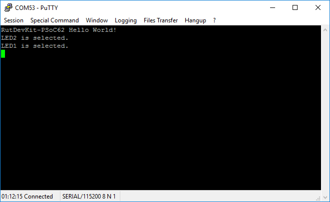
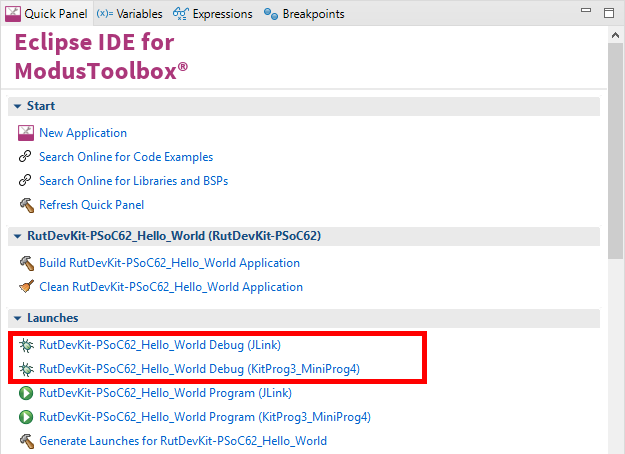

# RutDevKit-PSoC62 Hello World

Rutronik Development Kit Programmable System-on-Chip CY8C6245AZI-S3D72 "Hello World" Example. 

This example is an introduction to the basic components of the board: LEDs, Buttons and KitProg3 UART for debug.

 

### Using the code example with a ModusToolbox IDE:

1. Import the project: **File** > **Import...** > **General** > **Existing Projects into Workspace** > **Next**.
2. Select the directory where **"RutDevKit-PSoC62_Hello_World"** resides and click  **Finish**.
3. Select and build the project **Project ** > **Build Project**.

### Operation

The firmware example uses KitProg3 Debug UART for debug output. LED1 and LED2 is selected to blink once per second as a button USER_BTN1 or USER_BTN2 is pressed accordingly. Also LEDs are selected if **Enter** key is pressed on the terminal. Use yours preferred terminal software to track the debug output. 

### Debugging

If you successfully have imported the example, the debug configurations are already prepared to use with a the KitProg3, MiniProg4, or J-link. Open the ModusToolbox perspective and find the Quick Panel. Click on the desired debug launch configuration and wait for the programming completes and debug process starts.

## Legal Disclaimer

The evaluation board including the software is for testing purposes only and, because it has limited functions and limited resilience, is not suitable for permanent use under real conditions. If the evaluation board is nevertheless used under real conditions, this is done at one’s responsibility; any liability of Rutronik is insofar excluded. 

